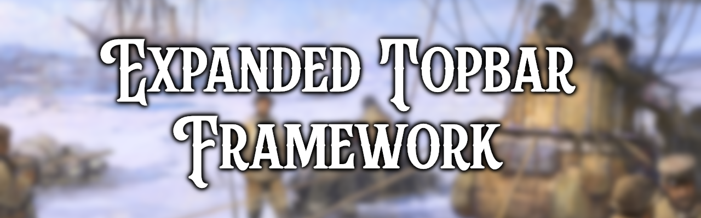

# Expanded Topbar Framework


This is a framework for mods to add elements to the expanded topbar.

## Steam Page
- https://steamcommunity.com/sharedfiles/filedetails/?id=3508296963

## Content
- [Starting Knowledge](#starting-knowledge)
- [Creating a new Topbar element](#creating-a-new-topbar-element)
- [Adding a Topbar element as default](#adding-a-topbar-element-as-default)
- [Achieving compatibility with existing Save Games](#achieving-compatibility-with-existing-save-games)
- [Error Suppression](#error-suppression)

### Starting Knowledge
There is a built-in scripted effect to add new topbar elements for modders `add_com_topbar_element`. ***YOU DON'T DEFINE THIS***, you call it in other effects.
##### Example 1
Calling it inside some effect code looks like this:
```
add_com_topbar_element = {
    element_name = com_topbar_element_prestige
}
```
This effect is then called, and takes (`element_name`) as an input.
### Creating a new Topbar element
> **NOTE:** all of this should be configured in your own mod!

#### Part 1 - Localization
Your element name (e.g. `com_topbar_element_prestige`) requires a localization key.

The following localization keys need to be setup for the element to work correctly (`<element name>` is a placeholder and needs to be replaced with your own name):
- **Required:** `<element name>` this is the element name referenced by `add_com_topbar_element` and it needs to contain the element name itself
- **Required:** `<element name>_icon` this is the icon shown in the topbar. It should be a text icon.
- **Required:** `<element name>_value` this is the value shown in the topbar
- **Required:** `<element name>_tooltip` this is the tooltip when hovering the topbar element
- **Required:** `<element name>_source` this will be shown in the configuration window and should contain the name of your mod
- **Required:** `<element name>_source_tooltip` this tooltip will be shown when hovering over the `source` in the configuration window
- **Optional:** `<element name>_window` if set this value will be set as a gui variable for `com_window_open` when the topbar element is clicked and can be checked like this: `[GetVariableSystem.HasValue('com_open_window', 'text in <element name>_window')]`
##### Example 2
Here is an example for `com_topbar_element_prestige` as used above:
```
l_english:
 # Prestige
 com_topbar_element_prestige: "com_topbar_element_prestige"
 com_topbar_element_prestige_icon: "@prestige!"
 com_topbar_element_prestige_value: "[GetPlayer.GetPrestige|v]"
 com_topbar_element_prestige_tooltip: "#header [concept_prestige]#!\n$concept_prestige_desc$"
 com_topbar_element_prestige_source: "Victoria 3"
 com_topbar_element_prestige_source_tooltip: "This element is part of the default Expanded Topbar Framework."
```
> **NOTE:** the first Loc is not a conventional loc, it is named itself.>

#### Part 2 - Scripted GUI
Secondly, there needs to be an SGUI configured (in `your_mod_folder\common\scripted_guis`) that has the same name as the element (`<element name>`).
Only the `is_shown` attribute is parsed by the framework.
This can be used to show or hide specific elements for specific countries.
##### Example 3
Here is an example for `com_topbar_element_prestige` as used above:
```
com_topbar_element_prestige = {
    scope = country

    is_shown = {
        always = yes
    }
}
```
If you don't want the topbar element to be visible at all times, replace `always = yes` with some conditions. i.e. an element related to Power Blocs might us `is_in_power_bloc=yes` so it only shows up when you are a member of a power bloc.
### Adding a Topbar element as Default
To add your element to the topbar on game start you need to add it to the `com_topbar_second_line` country scope list.

> **NOTE:** do not add your element to `com_topbar_first_line` since that is reserved for base game elements at game start.

The framework's `add_com_topbar_element` effect pre-sets a default scope with the element name which can be used to add your element to the topbar directly.

##### Example 4
In this example we add the `my_custom_topbar_element` element only for Britain and the `my_other_custom_topbar_element` element for all countries.

We will need an effect block with an `add_com_topbar_element` and an `add_to_variable_list` for each of our custom elements:
```
add_com_topbar_element = {
    element_name = my_custom_topbar_element
}
c:GBR = {
    add_to_variable_list = {
        name = com_topbar_second_line
        target = scope:my_custom_topbar_element
    }
}

add_com_topbar_element = {
    element_name = my_other_custom_topbar_element
}
every_country = {
    add_to_variable_list = {
        name = com_topbar_second_line
        target = scope:my_other_custom_topbar_element
    }
}
```
These can be done whenever you want, but it is recommended to either do it in GLOBAL = {} (in `common/history/global`) or in an `on_game_started_after_lobby` on action (`common/on_actions`).
##### Example 5
Here we are adding just one of our elements to every country at the start of the game:
```
on_game_started_after_lobby = {
	on_actions = { my_custom_topbar_activate }
}

my_custom_topbar_activate = {
	effect = {
		add_com_topbar_element = {
			element_name = my_other_custom_topbar_element
		}
		every_country = {
			add_to_variable_list = {
				name = com_topbar_second_line
				target = scope:my_other_custom_topbar_element
			}
		}
	}
}
```
Add as many other elements as desired inside the `effect = {}` block.

### Achieving compatibility with existing Save Games
Since topbar elements should generally be added at game start/setup, they will not show up for existing save games.
To mitigate this, you can set up a monthly on action to add your elements after the game started if they are missing.
##### Example 6
Here is an example for `my_other_custom_topbar_element` as used above:
```
# Adding base game elements if they are missing
on_monthly_pulse = {
    on_actions = {
        my_custom_topbar_save_game_compatibility
    }
}

# Adding base game elements if they are missing
my_custom_topbar_save_game_compatibility = {
    effect = {
        #= Prestige
        if = {
            limit = {
                NOT = {
                    any_in_global_list = {
                        variable = com_topbar_items
                        var:com_name ?= flag:my_other_custom_topbar_element
                    }
                }
            }
            add_com_topbar_element = {
                element_name = my_other_custom_topbar_element
            }
            every_country = {
                add_to_variable_list = {
                    name = com_topbar_second_line
                    target = scope:my_other_custom_topbar_element
                }
            }
        }
    }
}
```

### Error Suppression
Since the Expanded Topbar Framework can be totally optional, you might want to suppress errors that crop up when it is missing.
This can be done by defining a dummy scripted effect (in `common\scripted_effects`) with the same name: `add_com_topbar_element ` 
##### Example 7
Here is an example of how it could be done:
```
add_com_topbar_element = {
    if = {
        limit = { always = no }
        set_variable = $element_name$
        remove_variable = $element_name$
    }
}
```
You will put it in a file with a filename beginning with a number (0-9), "a", or "b".
This will ensure the dummy scripted effect in your mod will be overwritten by the framework.
> **NOTE:** This scripted effect ***needs*** to be defined in a file that is loaded before the Frameworks effect. The recommended filename is `00_com_topbar_element.txt`.